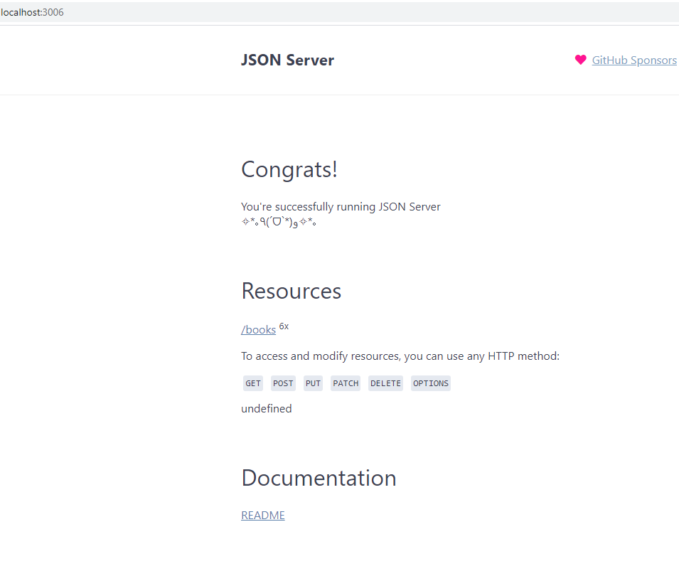

# book-store

This is a book store app developed in React framework

### Description

This is a simple book store application which has login page, book list and user can search the book and also can see the details of the book.

This project has 2 modules

- book-app (React Application)
- server-api (mock server api to hold book list)

### Prequesties

- node v12,16.3
- react 17
- json-server 0.16.3
- react-bootstrap 1.6.0

## Server API

This is a simple mock server api which hold the book list as json file. Refer db.json file.

Configure the below command in package.json file

```
json-server -p 3006 -w db.json

```

To start the server-api, run the below command

```
 npm start

```

```
http://localhost:3006/

```

## book-app

This is a simple application developed using React. Used React Hooks for State Management. This application has 3 components (header, login, book)

### Login

To log on the application, use the below credentials

Email ID: admin@bookstore.com
Password: admin123

If login failed, the error message **Invalid credentials** has been displayed in the login screen.

If login succeded, the user will navigate into the book store page.

### Header

In header component, user can able to search the book from the book store. Also user can able to see the logged in details and user can be to do logout from the application

### Book

In book component, user can able to see all the books (book list are retrived from server-api). Server-Api url has been configured in api folder.

User can easily change the real-time url without any further changes.

User can able to see the book details by clicking **Details** button.

Used Modal component from react-bootstrap to show the book details.

To start the book-app, run the below command

```
 npm start

```

```
http://localhost:3006/

```

### Screenshots




